# Word-level & Pose-based Sign Language Interpreter

I am passionate about "AI for Good" projects, and I have conceived an idea to develop an AI system that translates sign language. Individuals who use sign language often rely on fingerspelling—signing each letter individually—primarily when they do not know the correct sign or when spelling out names. Understanding this, I aim to create a solution that is not only technically impressive but also genuinely beneficial for the community. My vision is to go beyond merely recognizing individual letters and instead provide live captions for sign language without requiring specialized hardware like gloves or glasses.

```mermaid
graph LR
    subgraph "Streamlit User Interface 🖥️"
        A["👤 User<br>(Deaf Individual)"]
        A -->|Access| B["🖥️ Streamlit App<br>(streamlit_app.py)<br>(Real-Time ASL Translation)"]
        B -->|Capture Video| C["🎥 Webcam Input<br>(OpenCV: cv2.VideoCapture)"]
        C -->|Video Frames| D["🛠️ MediaPipe<br>Landmark Extraction<br>(180 Keypoints/Frame: 42 Hand, 6 Pose, 132 Face)"]
        D -->|Landmarks| E["📊 Display Landmarks<br>(Streamlit: st.image)<br>(Visualize 180 Keypoints in Real-Time)"]
        D -->|"Input: Landmarks<br>(frames, 180, 3)<br>(Fetch Predictions)"| F["🌐 FastAPI Endpoint<br>(serving/pose2gloss.py)<br>(/predict with payload {landmarks:ndarray(MAX_FRAMES, 180, 3), top_n})"]
        F -->|"Output: Top-N Glosses with Scores<br>(e.g., MOTHER: 0.85, LOVE: 0.90, FAMILY: 0.80)"| G["📝 Gloss-to-Text Translation<br>(Beam Search-like Selection Prompt)<br>(gloss2text/translator.py)"]
        G -->|Call API| H["🧠 GPT-4o-mini<br>(OpenAI API)<br>(max_tokens=100, temperature=0.7)"]
        H -->|"Natural English<br>(e.g., 'Mother loves her family.')"| G
        G -->|Display| I["📜 Display Translation<br>(Streamlit: st.text)<br>(Show Natural English Text in Real-Time, Latency <1s)"]
        F -->|Display| J["📊 Gloss Predictions<br>(Streamlit: st.table)<br>(Show Top-N Glosses with Scores)"]
        B -->|Interact| K["🖱️ User Controls<br>(Streamlit: st.button)<br>(Start/Stop Translation, Adjust Settings: top_n)"]
    end

    %% Styling for Color and Beauty
    style A fill:#FF69B4,stroke:#FF1493
    style B fill:#FF69B4,stroke:#FF1493
    style C fill:#FFD700,stroke:#DAA520
    style D fill:#32CD32,stroke:#228B22
    style E fill:#FF69B4,stroke:#FF1493
    style F fill:#FF8C00,stroke:#FF4500
    style G fill:#FFA500,stroke:#FF8C00
    style H fill:#FFA500,stroke:#FF8C00
    style I fill:#FF69B4,stroke:#FF1493
    style J fill:#FF69B4,stroke:#FF1493
    style K fill:#FF69B4,stroke:#FF1493
```

### I. Proposed solution: 

The input will be a video of deaf individuals using sign language, while the output will be the corresponding English text. The solution pipeline is structured as follows:

1. **Pose-to-Gloss**: I plan to utilize [MediaPipe](https://ai.google.dev/edge/mediapipe/solutions/guide) to extract facial and hand landmarks from each frame. These coordinates will be formatted correctly and fed into a **Transformer** model. The goal is to classify the isolated signs or glosses represented by these coordinates. This approach has several advantages:
-   By using key points instead of raw video data, we can streamline processing. We only need to analyze a small set of coordinates (3 for each point) per frame, significantly improving efficiency for real-time applications. Additionally, key points are less affected by varying backgrounds, hand sizes, skin tones, and other factors that complicate traditional image classification models.
-   A sequence model will allow us to learn both temporal and spatial information (hand movements) from sequences of key points across frames, rather than classifying each frame in isolation, which can prolong prediction times.
-   I intend to collect and preprocess the [WLASL](https://arxiv.org/pdf/1910.11006v2) dataset to train the **Pose-to-Gloss** model. Although this dataset contains around **2000 classes**, it is limited to about **5-6 examples per word**, leading to sparsity. To address this, I plan to adapt the [best solution](https://www.kaggle.com/competitions/asl-signs/discussion/406684) from the [Google - Isolated Sign Language Recognition competition](https://www.kaggle.com/competitions/asl-signs) on **Kaggle**, which utilizes a **Conv1D-Transformer** model.

2. **Gloss-to-Text**: This step involves translating the sequence of glosses into coherent, readable English text. As this is primarily a translation task, I plan to employ prompt engineering with [OpenAI's GPT-4o mini](https://openai.com/index/gpt-4o-mini-advancing-cost-efficient-intelligence/) to convert our classifier's gloss outputs into their appropriate translations without any additional fine-tuning.

### II. Focus on American Sign Language

Initially, our project will concentrate on **American Sign Language**. In future iterations, I plan to incorporate multilingual capabilities along with the following features:
-   Converting the output from text to audio.
-   Managing multiple signers within a single frame.
-   Implementing temporal segmentation to identify which frames contain sign language, enhancing translation accuracy and speed by allowing us to disregard irrelevant video content during inference.
-   Developing an end-to-end model for direct **Pose-to-Text** or even **Pose-to-Audio**. However, I anticipate challenges in processing entire videos compared to a defined set of key points. Additionally, I am uncertain whether omitting the gloss is a wise choice, as it provides direct insight into the signs being demonstrated.
-   Utilizing multimodal inputs to improve translation accuracy:
  
	-   **Audio Context**: In mixed environments, incorporating audio from non-signers can provide context, helping to disambiguate signs based on spoken topics.

	-   **Visual Context**: Integrating object detection or scene analysis can enhance understanding (e.g., recognizing a kitchen setting to interpret relevant signs).

### III. Demo Development

For the demonstration, I envision creating a website or an extension for video conferencing platforms like Google Meet to generate live captions for deaf individuals. However, I recognize that this concept primarily aids non-signers in understanding deaf individuals rather than empowering deaf people to communicate effectively. My current time constraints prevent me from implementing a text-to-sign feature, so for now, I can only conceptualize this one-way communication demo, rather than a two-way interaction that facilitates communication from deaf individuals back to others.

👉 Check the [docs](./docs/) folders for more information about the implementation.