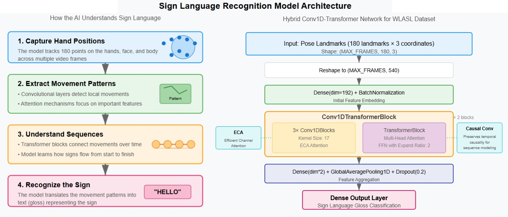

# Sprint 1: Proof of Concept (MLOps Level 0)

Firstly, the [standard WLASL](https://www.kaggle.com/datasets/risangbaskoro/wlasl-processed) dataset I found on **Kaggle** has numerous missing videos. To address this, I developed the [wlasl2landmarks.py](../preprocessing/wlasl2landmarks.py) script, which loops through each video path to verify its existence. If a video is missing, I will supplement it with similar data from [Sttaseen](https://www.kaggle.com/datasets/sttaseen/wlasl2000-resized). A crucial aspect of this process involves extracting key points from video frames using [MediaPipe](https://ai.google.dev/edge/mediapipe/solutions/guide):

- Initially, I created a `VideoLandmarksExtractor` class in [video2landmarks.py](../preprocessing/video2landmarks.py), which includes common functions for landmark extraction from both frames and videos. Subsequently, I developed a `WLASLLandmarksExtractor` that inherits from this class in [wlasl2landmarks.py](../preprocessing/wlasl2landmarks.py). This design allows for the potential inclusion of additional datasets in the future, making it easier to expand our project for landmark extraction across various data sources.
- The `VideoLandmarksExtractor` captures hand, pose, and face landmarks from video files. These landmarks are stored in a **numpy array** with each frame's shape defined as (`total_landmarks, 3`). The extraction process utilizes [MediaPipe](https://ai.google.dev/edge/mediapipe/solutions/guide) to analyze video frames and obtain the landmarks, which are filtered based on specified indices for hands, pose, and face.
- After extracting the landmarks, I format the key point data for model input. This process is time-consuming, as it involves looping through over **21,000 videos**. I had to keep my laptop running for **2 days** to complete this task.

Next, I prepared the data for model training, which involved splitting, augmenting, and normalizing each image based on the nose's center location (subtracting every point from the nose's coordinates). To ensure the data fits the model, I created a pipeline to feed preprocessed key point sequences, managing batching and padding. Each item in the dataset has a shape of (`MAX_FRAMES, 180, 3`), where `180` represents the number of selected landmarks: **42** for both hands, **6** for pose, and **132** for face. Some entries were padded with the value `-100` to achieve the `MAX_FRAMES`.

Regarding the **Pose-to-Gloss** model, I had concerns about the dataset I selected. According to the original paper, the results were as follows:

- **WLASL100**: **65.89%** for **top 1** accuracy and **84.11%** for **top 5** accuracy.
- **WLASL300**: **56.14%** for **top 1** accuracy and **79.94%** for **top 5** accuracy.

On the other hand, I walked through many resources (e.g., web blogs, papers, Medium, GitHub, YouTube videos, etc.) to help me conduct the project for this sprint. Below are some potential ones:

- The paper by [Yin and Read (2020)](https://github.com/kayoyin/transformer-slt) addressed a problem quite similar to ours: Sign Language Recognition and Sign Language Translation (Gloss-to-Text). They used a Spatial-Temporal Multi-Cue (STMC) network to extract features from multiple visual cues (face, hand, full-frame, pose) and a Transformer network for sequence learning and translation. The problem is that their STMC is for video-to-text translation, unlike our approach, Pose-to-text, for easier processing. Moreover, it is not open-source, so I can't have a look at customization.
- A significant milestone occurred when I discovered the [Google Isolated Language Recognition (GISLR) competitions](https://www.kaggle.com/competitions/asl-signs/discussion/406684) on **Kaggle**, where participants utilized landmark data extracted from MediaPipe to predict approximately 250 glosses. I decided to adopt the best solution from this competition for my **WLASL** dataset.

I planned to experiment with 2 versions of the data: **WLASL100** and **WLASL300**. To conduct my experiments, I needed to purchase **Google Colab Pro**, as I required additional memory resources to complete my training. Training larger data versions like **WLASL1000** or **WLASL2000** proved challenging due to resource constraints. However, the training process itself is quite rapid, taking only about **3-5** minutes, which validates my **Pose utilization approach**. I have included the notebook for my work on [WLASL100](../pose2gloss/WLASL100.ipynb), while the code for [WLASL300]((../pose2gloss/WLASL300.ipynb)) is quite similar.

Overall, these models tend to overfit significantly. Careful tuning of the learning rate is essential for achieving a better balance in performance. From my experiments, I found that [AdamW](https://www.tensorflow.org/api_docs/python/tf/keras/optimizers/AdamW) combined with [ReduceLROnPlateau](https://www.tensorflow.org/api_docs/python/tf/keras/callbacks/ReduceLROnPlateau) performed better than [Adam](https://www.tensorflow.org/api_docs/python/tf/keras/optimizers/Adam). I also experimented with various learning rate schedulers for [Adam](https://www.tensorflow.org/api_docs/python/tf/keras/optimizers/Adam), but they did not yield satisfactory results. The model architectures for **WLASL100** and **WLASL300** differ slightly, with both being trained for **100 epochs** and a maximum of **195 frames**:

- **WLASL100**: I employed a smaller dropout rate, trained with a batch size of `128`, and monitored it to reduce the learning rate by `0.7` if there was no improvement in `val_accuracy` after `5` epochs.
- **WLASL300**: I implemented heavier regularization with a dropout rate of `0.5` before the output layer and `0.3` for each **Conv1DBlock**. This model was trained with a batch size of `256`, and I reduced the learning rate by a factor of `0.7` if there was no improvement in `val_accuracy` after only `2` epochs. Its training was also more stable than **WLASL100**, likely due to the larger dataset.

While the model’s performance is not exceptionally high, I believe it is reasonable compared to the original paper. I am considering 2 options for improvement:

- **Enhance the model**: This option is simpler, as it may involve only minor adjustments to the model architecture.
- **Add new data**: Given that the landmark extraction process took several days, I am hesitant to pursue this option at this time.